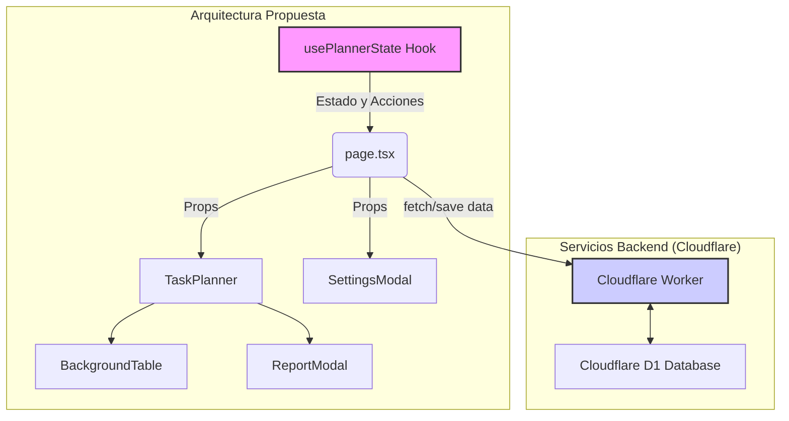

# 00 - Mapa de Arquitectura: Team Time

## 1. Resumen de Alto Nivel

"Team Time" es una aplicación web de planificación y seguimiento de tiempo, diseñada como una Single-Page Application (SPA). Su arquitectura actual está fuertemente orientada al cliente, donde la mayor parte de la lógica de estado y de negocio reside en el navegador. El backend actúa principalmente como un almacén de datos persistente y encriptado.

El proyecto se encuentra en una fase de refactorización para desacoplar la lógica de negocio de la interfaz de usuario, migrando hacia un patrón basado en hooks de React para una mejor separación de conceptos y testeabilidad.

## 2. Stack Tecnológico

| Capa              | Tecnología         | Propósito                                                   |
| :---------------- | :----------------- | :---------------------------------------------------------- |
| **Frontend**      | Next.js (React)    | Framework para la interfaz de usuario.                      |
|                   | TypeScript         | Tipado estático para robustez del código.                   |
| **Backend**       | Cloudflare Workers | Lógica serverless para acceder a la base de datos.          |
| **Base de Datos** | Cloudflare D1      | Almacenamiento SQL para datos de usuario encriptados.       |
| **Despliegue**    | Cloudflare Pages   | Hosting y despliegue de la aplicación Next.js.              |
| **Seguridad**     | Node.js Crypto     | Encriptación (AES-256-GCM) y derivación de claves (PBKDF2). |

## 3. Patrón de Diseño

- **Arquitectura Actual:** Monolito del lado del cliente. Un "God Component" (`/src/app/page.tsx`) centraliza la mayoría de las responsabilidades, incluyendo gestión de estado, lógica de negocio y renderizado de la UI. Esto dificulta el mantenimiento y la reutilización.

- **Arquitectura Propuesta (En Transición):** Arquitectura desacoplada basada en **Hooks y Componentes**. La lógica de estado y las acciones se extraen a un hook personalizado (`usePlannerState`), dejando los componentes de React como capas de presentación puras.

## 4. Comunicación entre Módulos

El flujo de datos es predominantemente unidireccional (Top-Down), desde el componente principal hacia los componentes hijos a través de props. La refactorización introduce un hook central que actúa como única fuente de verdad.

**Navegación:**

- Continúa con el Flujo de Datos: 01_DATA_FLOW.md
- Explora los módulos: 02_MODULE_INDEX.md
