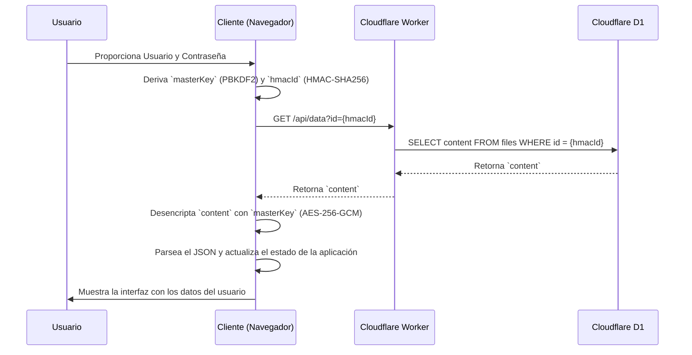
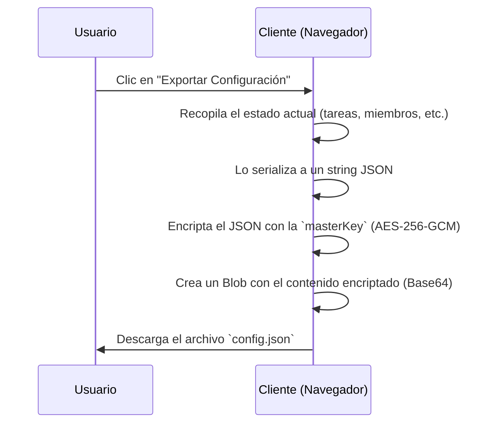

# 01 - Flujo de Datos

Este documento describe los ciclos de vida de las peticiones y datos más importantes en la aplicación "Team Time".

## 1. Flujo de Autenticación y Carga de Datos del Usuario

La aplicación no tiene un sistema de login tradicional. En su lugar, utiliza un par de credenciales (usuario/contraseña) para derivar una clave y acceder a un blob de datos encriptado y único para cada usuario.

**Descripción del Flujo:**

1.  **Entrada de Credenciales:** El usuario introduce su nombre de usuario y contraseña en la interfaz.
2.  **Derivación de Clave:** El cliente utiliza `crypto.pbkdf2Sync` para derivar una clave maestra a partir de la contraseña y el nombre de usuario (usado como _salt_). También genera un `hmacId` determinístico para identificar al usuario en la base de datos.
3.  **Petición de Datos:** El cliente realiza una petición a un endpoint del Worker, pasando el `hmacId` como identificador.
4.  **Acceso a DB:** El Worker consulta la base de datos D1 para obtener el blob de datos encriptado (`encryptedData`) que corresponde a ese `hmacId`.
5.  **Desencriptación:** El cliente recibe el blob y lo desencripta usando la clave maestra generada en el paso 2.
6.  **Hidratación del Estado:** El JSON resultante se utiliza para poblar el estado de la aplicación (tareas, miembros, etc.), renderizando la interfaz.

---

## 2. Flujo de Exportación de Configuración

El usuario puede exportar su estado actual a un archivo `.json` encriptado.

**Descripción del Flujo:**

1.  **Acción de Usuario:** El usuario inicia la exportación.
2.  **Serialización:** La aplicación recopila el estado actual de todos los módulos y lo convierte en un string JSON.
3.  **Encriptación:** Este string se encripta usando la misma `masterKey` del usuario.
4.  **Generación de Archivo:** Se genera un archivo descargable que contiene los datos encriptados, listo para ser guardado o compartido. La importación seguiría el proceso inverso.

**Navegación:**

- Volver al Mapa de Arquitectura: 00_ARCHITECTURE_MAP.md
- Explora los módulos: 02_MODULE_INDEX.md
